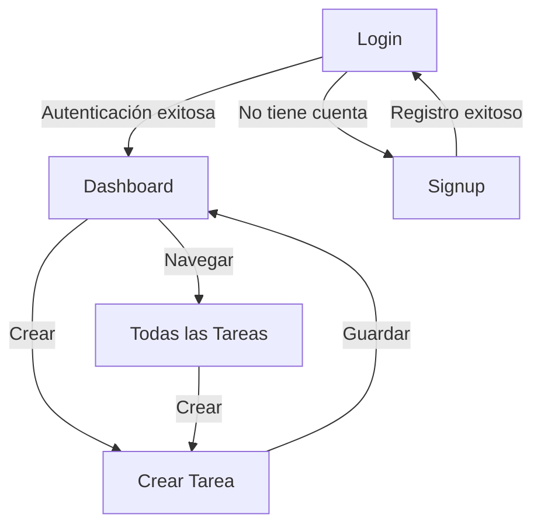

# TaskGener - Documentación Completa de la Aplicación

## Documento Técnico para IA y Product Managers

> **Última actualización:** 14 de diciembre de 2025  
> **Versión:** 1.0.0  
> **Autor:** Proyecto Manager-Tasks  
> **Propósito:** Documentación exhaustiva para IA, desarrollo y gestión de producto

---

## 📋 Índice

1. [Visión General](#visión-general)
2. [Arquitectura de la Aplicación](#arquitectura-de-la-aplicación)
3. [Sistema de Diseño](#sistema-de-diseño)
4. [Estructura de Archivos](#estructura-de-archivos)
5. [Funcionalidades](#funcionalidades)
6. [Base de Datos](#base-de-datos)
7. [Flujos de Usuario](#flujos-de-usuario)
8. [Componentes UI](#componentes-ui)
9. [Guía de Estilo y Branding](#guía-de-estilo-y-branding)
10. [Stack Tecnológico](#stack-tecnológico)

---

## 🎯 Visión General

### ¿Qué es TaskGener?

**TaskGener** es una aplicación web de gestión de tareas diseñada para el **Jaume Viladoms Centre Educatiu**. Es un gestor de tareas moderno, intuitivo y con un diseño personalizado que permite a los usuarios organizar, crear, visualizar y gestionar sus tareas de manera eficiente.

### Propósito y Objetivos

- **Objetivo Principal:** Proporcionar una herramienta de gestión de tareas simple pero potente
- **Target:** Estudiantes y profesores del centro educativo
- **USP (Unique Selling Point):** Diseño limpio y moderno con identidad visual del centro educativo
- **Plataforma:** Web (responsive design)

### Características Principales

✅ Sistema de autenticación (Login/Signup)  
✅ Dashboard con estadísticas de tareas  
✅ Visualización de todas las tareas  
✅ Creación de nuevas tareas con etiquetas  
✅ Sistema de prioridades  
✅ Filtrado por estados (Pendiente/Completado)  
✅ Sistema de etiquetas categorizadas por colores  
✅ Diseño responsive y accesible

---

## 🏗️ Arquitectura de la Aplicación

### Tipo de Arquitectura

- **Patrón:** Frontend-Backend separados (actualmente Frontend principalmente)
- **Frontend:** HTML5 + TypeScript + Tailwind CSS
- **Backend:** SQLite (preparado para migración a servidor)
- **Estado:** LocalStorage (transitorio) + Base de datos SQLite

### Estructura de Capas

```
┌─────────────────────────────────────┐
│         CAPA DE PRESENTACIÓN        │
│     (HTML + Tailwind CSS)           │
├─────────────────────────────────────┤
│         CAPA DE LÓGICA              │
│        (TypeScript)                 │
├─────────────────────────────────────┤
│         CAPA DE DATOS               │
│  (LocalStorage + SQLite DB)         │
└─────────────────────────────────────┘
```

### Páginas Principales

1. **login.html** - Pantalla de inicio de sesión
2. **signup.html** - Pantalla de registro de usuarios
3. **index.html** - Dashboard principal con estadísticas
4. **todasLasTareas.html** - Vista de lista completa de tareas
5. **crearTarea.html** - Formulario de creación de tareas

### Flujo de Navegación



---

## 🎨 Sistema de Diseño

### Filosofía de Diseño

El diseño de TaskGener está basado en:

- **Minimalismo:** Interfaces limpias sin elementos innecesarios
- **Funcionalidad:** Cada elemento tiene un propósito claro
- **Accesibilidad:** Contraste alto, tipografía legible
- **Consistencia:** Uso coherente de colores, espaciados y componentes

### Paleta de Colores

#### Colores Primarios

| Nombre           | Hex       | RGB            | Uso Principal                          |
| ---------------- | --------- | -------------- | -------------------------------------- |
| **Primary**      | `#6d5dfb` | `109, 93, 251` | Botones, enlaces, elementos destacados |
| **Primary Dark** | `#362c77` | `54, 44, 119`  | Bordes, hover states, textos enfáticos |

#### Colores Neutrales

| Nombre             | Hex       | RGB             | Uso Principal                    |
| ------------------ | --------- | --------------- | -------------------------------- |
| **Neutral Light**  | `#f7f7fb` | `247, 247, 251` | Fondos de inputs y cards         |
| **Neutral Medium** | `#d4d4e0` | `212, 212, 224` | Placeholders, texto secundario   |
| **Neutral Dark**   | `#1f1f29` | `31, 31, 41`    | Bordes principales, texto fuerte |

#### Colores de Estado

| Nombre      | Hex       | RGB             | Uso Principal       |
| ----------- | --------- | --------------- | ------------------- |
| **Success** | `#32d18a` | `50, 209, 138`  | Tareas completadas  |
| **Warning** | `#ffca65` | `255, 202, 101` | Tareas pendientes   |
| **Pink BG** | `#ffc9c9` | `255, 201, 201` | Fondo del dashboard |
| **Red**     | `#ff6b6b` | `255, 107, 107` | Prioridades altas   |

### Tipografía

#### Familia Tipográfica

- **Font Family:** [Inter](https://fonts.google.com/specimen/Inter) (Google Fonts)
- **Pesos utilizados:**
  - **400** - Regular (texto normal)
  - **600** - Semi-Bold (subtítulos)
  - **700** - Bold (títulos)
  - **800** - Extra Bold (títulos principales, labels)

#### Escala Tipográfica

| Elemento          | Tamaño | Peso | Line Height | Uso                   |
| ----------------- | ------ | ---- | ----------- | --------------------- |
| **H1 Principal**  | 28px   | 700  | Tight       | Título Dashboard      |
| **H1 Formulario** | 24px   | 800  | Normal      | Título Crear Cuenta   |
| **Label Grande**  | 16px   | 800  | Normal      | Labels de inputs      |
| **Label Pequeño** | 14px   | 800  | Normal      | Labels secundarios    |
| **Body Regular**  | 16px   | 400  | Normal      | Texto general         |
| **Body Small**    | 14px   | 400  | Normal      | Texto secundario      |
| **Caption**       | 12px   | 400  | Normal      | Metadatos, notas      |
| **Estadísticas**  | 32px   | 700  | None        | Números del dashboard |

### Espaciado y Dimensiones

#### Sistema de Espaciado

Basado en múltiplos de **4px** para consistencia:

| Token       | Valor | Uso                         |
| ----------- | ----- | --------------------------- |
| `spacerxs`  | 4px   | Padding mínimo              |
| `spacers`   | 8px   | Padding pequeño             |
| `spacerm`   | 16px  | Padding medio (estándar)    |
| `spacerx`   | 24px  | Padding grande              |
| `spacerxl`  | 32px  | Padding extra grande        |
| `spacerxxl` | 40px  | Padding extra extra grande  |
| `gap-20`    | 20px  | Gap entre elementos         |
| `gap-45`    | 45px  | Gap especial (header logos) |

#### Border Radius

| Token   | Valor | Uso                 |
| ------- | ----- | ------------------- |
| Pequeño | 6px   | Logo containers     |
| Medio   | 8px   | Inputs              |
| Grande  | 16px  | Cards, contenedores |

#### Sombras

| Nombre      | Valor                                 | Uso            |
| ----------- | ------------------------------------- | -------------- |
| Card Shadow | `0px 4px 4px 0px rgba(0, 0, 0, 0.25)` | Cards, modales |

### Iconografía

#### Biblioteca de Iconos

- **Proveedor:** [Font Awesome 6.5.1](https://fontawesome.com/)
- **CDN:** CloudFlare
- **Tipos utilizados:** Solid (`fas`), Brands (`fab`)

#### Código de Colores para Iconos/Tags

| Categoría           | Color      | Hex       | Ejemplo Tags                      |
| ------------------- | ---------- | --------- | --------------------------------- |
| **Categorías**      | Negro/Dark | `#1f1f29` | Frontend, Backend, Design, Mobile |
| **Prioridades**     | Rojo       | `#ff6b6b` | Alta, Media, Baja, Urgente        |
| **Tecnologías**     | Morado     | `#6d5dfb` | React, Vue, Node.js, SQL, Python  |
| **Estados OK**      | Verde      | `#32d18a` | Completado                        |
| **Estados Pending** | Amarillo   | `#ffca65` | Pendiente                         |

#### Iconos por Función

**Navegación:**

- Dashboard: `<i class="fas fa-chart-line"></i>`
- Todas las tareas: `<i class="fas fa-list-check"></i>`
- Crear tarea: `<i class="fas fa-plus"></i>`

**Estados:**

- Pendiente: `<i class="fas fa-clock"></i>`
- En progreso: `<i class="fas fa-spinner"></i>`
- Completado: `<i class="fas fa-check-circle"></i>`

**Prioridades:**

- Alta: `<i class="fas fa-exclamation-circle"></i>`
- Media: `<i class="fas fa-minus-circle"></i>`
- Baja: `<i class="fas fa-arrow-down"></i>`

---

## 📁 Estructura de Archivos

```
manager-tasks/
├── index.html                  # Dashboard principal
├── login.html                  # Pantalla de login
├── signup.html                 # Pantalla de registro
├── crearTarea.html            # Formulario crear tarea
├── todasLasTareas.html        # Lista de todas las tareas
├── package.json                # Dependencias del proyecto
├── tsconfig.json               # Configuración TypeScript
├── tailwind.config.js          # Configuración Tailwind CSS
├── README.md                   # Readme básico
├── DESIGN_IMPLEMENTATION.md    # Documentación de diseño
├── ICON_COLOR_GUIDE.md        # Guía de iconos y colores
│
├── db/
│   └── init.sql               # Schema inicial de la base de datos
│
├── src/
│   ├── index.css              # Estilos personalizados
│   └── assets/                # Recursos estáticos
│       ├── logoJV.png         # Logo Jaume Viladoms
│       └── logoMarcaSVG.svg   # Logo TaskGener (hexagonal)
│
└── TS/
    ├── script.ts              # Lógica principal (dashboard, tareas)
    ├── login.ts               # Lógica de autenticación
    └── signup.ts              # Lógica de registro
```

### Compilación TypeScript

Los archivos `.ts` se compilan a JavaScript en la carpeta `dist/`:

```Bash
TS/script.ts   → dist/script.js
TS/login.ts    → dist/login.js
TS/signup.ts   → dist/signup.js
```

---

## ⚙️ Funcionalidades

### 1. Sistema de Autenticación

#### Login (login.html)

**Campos:**

- Usuario (text input)
- Contraseña (password input)

**Validaciones:**

- Campos requeridos
- Verificación contra base de datos

**Flujo:**

1. Usuario ingresa credenciales
2. Sistema valida contra tabla `USERS`
3. Si es correcto → Almacena sesión en localStorage
4. Redirige a dashboard (index.html)
5. Si es incorrecto → Muestra error

**Estado actual:**

- ⚠️ Usa localStorage temporalmente
- 🔄 Pendiente: Implementar autenticación real con backend

#### Signup (signup.html)

**Campos:**

- Nombre (firstname)
- Apellidos (lastname)
- Usuario (username)
- Email (email)
- Contraseña (password)

**Validaciones:**

- Todos los campos requeridos
- Email válido
- Usuario único
- Contraseña mínima (pendiente definir)

**Flujo:**

1. Usuario completa formulario
2. Sistema valida datos
3. Encripta contraseña
4. Inserta en tabla `USERS`
5. Redirige a login

### 2. Dashboard (index.html)

#### Componentes del Dashboard

**Sidebar Izquierdo:**

- Logo del centro educativo
- Navegación:
  - ☑ Dashboard
  - ☑ Todas las tareas
  - ➕ Crear tarea
- Estadísticas rápidas:
  - Tareas totales
  - Tareas completadas

**Área Principal:**

- Header con título "Dashboard"
- Botón "Opciones"
- 3 Cards de estadísticas:
  - Tareas totales
  - Tareas en camino (en progreso)
  - Tareas completadas
- Botón de crear tarea (modal)
- Lista de tareas recientes/destacadas

#### Medidas Específicas del Sidebar

- **Ancho:** 200px (index) / 335px (otras páginas)
- **Border:** 2px solid black
- **Padding:** 16px
- **Logo height:** 130px (index) / 162px (otras)

### 3. Gestión de Tareas

#### Crear Tarea (crearTarea.html + Modal)

**Campos del formulario:**

- **Título\*** (obligatorio)
- **Descripción** (opcional)
- **Fecha** (date picker)
- **Prioridad** (número 1-5)
- **Etiquetas** (múltiples, separadas por coma)
- **Estado** (Pendiente/Completado)

**Interfaz:**

```typescript
interface tarea {
	titulo: string;
	descripcion?: string;
	estado: number; // 0 = Pendiente, 1 = Completado
	fecha?: Date;
	prioridad: number; // 1-5
	etiquetas: string[];
}
```

**Flujo de Creación:**

1. Usuario abre modal/página
2. Completa formulario
3. Valida campos obligatorios
4. Guarda en localStorage (temporal) o DB
5. Actualiza vista
6. Cierra modal/redirige

#### Ver Todas las Tareas (todasLasTareas.html)

**Funcionalidades:**

- Lista completa de tareas
- Filtros:
  - Por estado (Pendiente/Completado)
  - Por prioridad
  - Por etiquetas
- Búsqueda por título
- Ordenamiento:
  - Por fecha
  - Por prioridad
  - Por estado

**Layout:**

- Sidebar de navegación
- Área principal con grid/lista de cards de tareas
- Cada card muestra:
  - Título
  - Descripción (truncada)
  - Fecha
  - Prioridad (icono/badge)
  - Etiquetas (badges de colores)
  - Estado (badge verde/amarillo)

### 4. Sistema de Etiquetas (Tags)

#### Categorías de Etiquetas

**1. Categorías de Proyecto** (Color: `#1f1f29`)

- Frontend
- Backend
- Fullstack
- Design
- Mobile
- DevOps
- Testing
- Documentation

**2. Prioridades** (Color: `#ff6b6b`)

- Alta
- Media
- Baja
- Urgente
- Crítico

**3. Tecnologías** (Color: `#6d5dfb`)

- React
- Vue.js
- Angular
- Node.js
- SQL
- Python
- TypeScript
- JavaScript

#### Implementación de Tags

```html
<!-- Ejemplo de tag -->
<span
	class="inline-flex items-center gap-1 px-2 py-1 bg-white border border-gray-300 rounded text-xs">
	<i class="fas fa-tag text-[#6d5dfb]"></i>
	React
</span>
```

---

## 🗄️ Base de Datos

### Diagrama Entidad-Relación

```
USERS (1) ──────< (N) TASKS (N) >────── (N) TAGS
   │                    │                    │
   │                    └──── TASKS_TAGS ────┘
   │
   id (PK)          id (PK)              id (PK)
   firstname        title                name
   lastname         description          color
   username         state
   email            date
   password         priority
                    user_id (FK)
```

### Tablas de la Base de Datos

#### USERS

```sql
CREATE TABLE IF NOT EXISTS "USERS" (
    "id" INTEGER NOT NULL PRIMARY KEY AUTOINCREMENT,
    "firstname" TEXT,
    "lastname" TEXT,
    "username" TEXT,
    "email" TEXT,
    "password" TEXT
);
```

**Campos:**

- `id` - Identificador único
- `firstname` - Nombre del usuario
- `lastname` - Apellidos del usuario
- `username` - Nombre de usuario (único)
- `email` - Email (único)
- `password` - Contraseña hasheada

#### TASKS

```sql
CREATE TABLE IF NOT EXISTS "TASKS" (
    "id" INTEGER NOT NULL PRIMARY KEY AUTOINCREMENT,
    "title" TEXT,
    "description" TEXT,
    "state" INTEGER CHECK("state" IN (0, 1)),
    "date" TEXT,
    "priority" INTEGER,
    "user_id" INTEGER,
    FOREIGN KEY("user_id") REFERENCES "USERS"("id")
);
```

**Campos:**

- `id` - Identificador único
- `title` - Título de la tarea
- `description` - Descripción detallada
- `state` - Estado: 0 (Pendiente), 1 (Completado)
- `date` - Fecha (formato ISO8601: YYYY-MM-DD)
- `priority` - Nivel de prioridad (1-5)
- `user_id` - ID del usuario propietario

#### TAGS

```sql
CREATE TABLE IF NOT EXISTS "TAGS" (
    "id" INTEGER NOT NULL PRIMARY KEY AUTOINCREMENT,
    "name" TEXT,
    "color" TEXT
);
```

**Campos:**

- `id` - Identificador único
- `name` - Nombre del tag
- `color` - Color en hexadecimal

#### TASKS_TAGS

```sql
CREATE TABLE IF NOT EXISTS "TASKS_TAGS" (
    "id" INTEGER NOT NULL PRIMARY KEY AUTOINCREMENT,
    "tasks_id" INTEGER,
    "tags_id" INTEGER,
    FOREIGN KEY("tasks_id") REFERENCES "TASKS"("id"),
    FOREIGN KEY("tags_id") REFERENCES "TAGS"("id")
);
```

**Relación muchos a muchos** entre TASKS y TAGS.

---

## 🔄 Flujos de Usuario

### Flujo 1: Primer Uso

```
1. Usuario abre la aplicación
   ↓
2. No hay sesión → Redirige a login.html
   ↓
3. Usuario hace clic en "Crear cuenta"
   ↓
4. Completa formulario de signup.html
   ↓
5. Sistema crea cuenta en USERS
   ↓
6. Redirige a login.html
   ↓
7. Usuario ingresa credenciales
   ↓
8. Sistema valida y crea sesión
   ↓
9. Redirige a index.html (Dashboard)
```

### Flujo 2: Crear una Tarea

```
1. Usuario está en Dashboard o Todas las Tareas
   ↓
2. Hace clic en "Crear tarea" o botón +
   ↓
3. Se abre modal/página crearTarea.html
   ↓
4. Usuario completa:
   - Título*
   - Descripción
   - Fecha
   - Prioridad
   - Etiquetas
   ↓
5. Hace clic en "Crear"
   ↓
6. Sistema valida campos
   ↓
7. Si válido:
   - Inserta en tabla TASKS
   - Asocia etiquetas en TASKS_TAGS
   - Actualiza vista
   - Cierra modal
   ↓
8. Si inválido:
   - Muestra errores
   - Usuario corrige
```

### Flujo 3: Ver y Filtrar Tareas

```
1. Usuario navega a "Todas las tareas"
   ↓
2. Sistema carga todas las tareas del usuario
   ↓
3. Usuario puede:
   - Buscar por título
   - Filtrar por estado
   - Filtrar por etiqueta
   - Ordenar por fecha/prioridad
   ↓
4. Vista se actualiza dinámicamente
   ↓
5. Usuario hace clic en una tarea
   ↓
6. Se muestra detalle completo
   ↓
7. Usuario puede:
   - Editar
   - Marcar como completada
   - Eliminar
```

---

## 🎨 Componentes UI

### Componente: Header con Logos

**Ubicación:** login.html, signup.html

**Estructura:**

```html
<div
	class="flex items-center justify-center gap-[45px] p-4 rounded-2xl shadow-card max-w-[528px]">
	<!-- Logo Escuela -->
	<div class="bg-neutral-light p-2 rounded-md w-[222px]">
		
	</div>

	<!-- Separador -->
	<div class="w-0 h-[76px] border-l-2 border-primary"></div>

	<!-- Logo TaskGener -->
	<div class="w-[104px] h-[123px]">
		
	</div>
</div>
```

**Medidas exactas:**

- Ancho máximo: 528px
- Gap entre logos: 45px
- Logo escuela: 222px × 114px
- Separador: 76px altura
- Logo TaskGener: 104px × 123px

### Componente: Formulario de Login/Signup

**Características:**

- Fondo: `#f7f7fb`
- Border: 2px solid `#1f1f29`
- Border radius: 16px
- Padding: 16px
- Labels: Inter Extra Bold, 16px, color `#6d5dfb`
- Inputs:
  - Background: `#f7f7fb`
  - Border: 1px solid `#362c77`
  - Border radius: 8px
  - Height: 66px
  - Placeholder: color `#d4d4e0`

### Componente: Sidebar de Navegación

**Estructura:**

```html
<aside class="w-[200px] border-2 border-black rounded p-4 flex flex-col gap-4">
	<!-- Logo -->
	<div class="h-[130px]">
		
	</div>

	<!-- Nav items -->
	<nav class="flex flex-col gap-2">
		<label
			class="bg-white border border-gray-400 rounded p-3 flex items-center gap-3">
			<input type="checkbox" />
			<span>Dashboard</span>
		</label>
		<!-- Más items... -->
	</nav>

	<!-- Estadísticas -->
	<div class="flex flex-col gap-2">
		<div class="bg-gray-50 rounded p-3">
			<p class="text-gray-600 text-xs">Tareas totales</p>
			<p class="text-primary-dark text-base font-semibold">24</p>
		</div>
	</div>
</aside>
```

### Componente: Card de Tarea

**Estructura:**

```html
<div
	class="bg-white border-2 border-neutral-dark rounded-2xl p-4 flex flex-col gap-3">
	<!-- Header -->
	<div class="flex items-start justify-between">
		<h3 class="text-neutral-dark font-bold text-lg">Título de la tarea</h3>
		<span class="bg-warning text-white px-2 py-1 rounded text-xs"
			>Pendiente</span
		>
	</div>

	<!-- Descripción -->
	<p class="text-neutral-dark text-sm">Descripción de la tarea...</p>

	<!-- Metadata -->
	<div class="flex items-center gap-2 text-xs text-gray-600">
		<i class="fas fa-calendar"></i>
		<span>15/12/2025</span>
		<i class="fas fa-exclamation-circle text-[#ff6b6b]"></i>
		<span>Prioridad Alta</span>
	</div>

	<!-- Tags -->
	<div class="flex flex-wrap gap-2">
		<span
			class="inline-flex items-center gap-1 px-2 py-1 bg-white border rounded text-xs">
			<i class="fas fa-tag text-[#6d5dfb]"></i>
			React
		</span>
	</div>
</div>
```

### Componente: Botón Primario

```html
<button
	class="bg-primary text-white px-4 py-2 rounded text-sm font-semibold hover:bg-primary-dark transition-colors">
	Texto del Botón
</button>
```

### Componente: Modal

El modal se crea dinámicamente con JavaScript (ver `script.ts` función `abrirModal()`):

**Características:**

- Overlay oscuro semi-transparente
- Ventana modal centrada
- Formulario con todos los campos de tarea
- Botones "Crear" y "Cancelar"

---

## 🎯 Guía de Estilo y Branding

### Identidad Visual

**TaskGener** combina la identidad del **Jaume Viladoms Centre Educatiu** con una estética moderna de gestión de tareas.

#### Elementos de Marca

1. **Logo Escuela (Jaume Viladoms)**

   - Formato: PNG
   - Ubicación: `src/assets/logoJV.png`
   - Uso: Sidebar, headers
   - Aspect ratio: ~1.95:1

2. **Logo TaskGener**
   - Formato: SVG
   - Ubicación: `src/assets/logoMarcaSVG.svg`
   - Diseño: Hexagonal con colores primary/primary-dark
   - Dimensiones: 104px × 123px

### Voz y Tono

- **Formal pero amigable:** Lenguaje claro y directo
- **Educativo:** Orientado al contexto académico
- **Motivador:** Mensajes positivos al completar tareas
- **Preciso:** Instrucciones claras y sin ambigüedades

### Mensajes Tipo

**Éxito:**

- "¡Tarea creada con éxito!"
- "¡Genial! Tarea completada"

**Error:**

- "Por favor, completa todos los campos obligatorios"
- "Usuario o contraseña incorrectos"

**Información:**

- "No tienes tareas pendientes"
- "Tienes X tareas para hoy"

---

## 💻 Stack Tecnológico

### Frontend

| Tecnología       | Versión | Propósito                   |
| ---------------- | ------- | --------------------------- |
| **HTML5**        | -       | Estructura semántica        |
| **TypeScript**   | 5.9.3   | Lógica de aplicación        |
| **Tailwind CSS** | 3.x CDN | Framework CSS utility-first |
| **Font Awesome** | 6.5.1   | Iconografía                 |
| **Google Fonts** | -       | Tipografía (Inter)          |

### Backend (Preparado)

| Tecnología | Versión | Propósito                |
| ---------- | ------- | ------------------------ |
| **SQLite** | 3.x     | Base de datos relacional |

### Herramientas de Desarrollo

| Herramienta             | Propósito              |
| ----------------------- | ---------------------- |
| **npm**                 | Gestor de paquetes     |
| **TypeScript Compiler** | Compilación de TS a JS |
| **Git**                 | Control de versiones   |

### Configuraciones Importantes

#### tsconfig.json

```json
{
	"compilerOptions": {
		"target": "ES6",
		"module": "commonjs",
		"outDir": "./dist",
		"rootDir": "./TS",
		"strict": true
	}
}
```

#### tailwind.config.js

Configuración personalizada con:

- Colores del sistema de diseño
- Espaciados personalizados
- Border radius personalizados
- Familia tipográfica Inter
- Sombras personalizadas

### Dependencias

```json
{
	"devDependencies": {
		"typescript": "^5.9.3"
	}
}
```

---

## 📊 Métricas y KPIs (Sugeridos)

### Para Product Manager

**Métricas de Usuario:**

- Usuarios registrados
- Tasa de retención
- Tareas creadas por usuario/día
- Tasa de completación de tareas

**Métricas de Producto:**

- Tiempo promedio de creación de tarea
- Páginas más visitadas
- Uso de etiquetas más populares
- Errores de formulario más comunes

**Métricas Técnicas:**

- Tiempo de carga de página
- Errores de JavaScript
- Compatibilidad de navegadores

---

## 🚀 Roadmap Futuro (Sugerencias)

### Fase 1 - MVP Actual ✅

- [x] Sistema de autenticación básico
- [x] CRUD de tareas
- [x] Dashboard con estadísticas
- [x] Sistema de etiquetas

### Fase 2 - Backend Completo

- [ ] Migrar de localStorage a API REST
- [ ] Implementar autenticación JWT
- [ ] Hash de contraseñas (bcrypt)
- [ ] Validaciones backend

### Fase 3 - Funcionalidades Avanzadas

- [ ] Tareas colaborativas
- [ ] Notificaciones
- [ ] Calendario integrado
- [ ] Búsqueda avanzada
- [ ] Exportar tareas (PDF, Excel)

### Fase 4 - Mobile & PWA

- [ ] Optimización mobile
- [ ] Progressive Web App
- [ ] Offline mode
- [ ] Push notifications

---

## 🛠️ Instrucciones para Desarrollo

### Clonar y Configurar

```bash
# Clonar repositorio
git clone https://github.com/vandalieu06/mangaer-tasks.git
cd manager-tasks

# Instalar dependencias
npm install

# Compilar TypeScript
tsc

# Abrir en navegador
# Simplemente abrir index.html en un navegador
# o usar un servidor local como Live Server
```

### Compilar TypeScript

```bash
# Compilación única
tsc

# Modo watch (recompila automáticamente)
tsc --watch
```

### Estructura de Desarrollo

1. **HTML:** Editar archivos `.html` en raíz
2. **Estilos:** Usar clases de Tailwind inline
3. **Lógica:** Editar archivos `.ts` en carpeta `TS/`
4. **Assets:** Agregar imágenes en `src/assets/`
5. **Base de Datos:** Modificar schema en `db/init.sql`

---

## 📝 Convenciones de Código

### HTML

- Usar indentación con tabs
- Atributos en orden: clase, id, data-\*, eventos
- Usar atributos semánticos (alt, title, aria-\*)

### TypeScript

- CamelCase para variables y funciones
- PascalCase para interfaces y clases
- Tipado estricto
- Comentarios en español

### CSS/Tailwind

- Preferir clases de Tailwind
- Custom CSS solo cuando sea necesario
- Usar tokens de configuración (colors, spacing)

### Nomenclatura de Archivos

- HTML: lowercase con guiones: `crear-tarea.html`
- TS: camelCase: `script.ts`
- Imágenes: descriptivo: `logoJV.png`

---

## 🔍 Casos de Uso Detallados

### Caso de Uso 1: Estudiante organiza tareas de proyecto

**Actor:** Estudiante de desarrollo web

**Objetivo:** Crear y organizar tareas para un proyecto de React

**Precondiciones:** Usuario autenticado

**Flujo:**

1. Estudiante accede al dashboard
2. Ve que tiene 5 tareas pendientes
3. Hace clic en "Crear tarea"
4. Completa formulario:
   - Título: "Implementar componente de Login"
   - Descripción: "Crear componente React con validación de formulario"
   - Fecha: 20/12/2025
   - Prioridad: Alta (4)
   - Etiquetas: "React, Frontend, forms"
5. Guarda la tarea
6. La tarea aparece en el dashboard con etiquetas moradas (tecnología)
7. Estudiante puede filtrar por etiqueta "React" para ver todas las tareas relacionadas

### Caso de Uso 2: Profesor revisa progreso

**Actor:** Profesor

**Objetivo:** Revisar tareas completadas de la semana

**Precondiciones:** Usuario autenticado con tareas en el sistema

**Flujo:**

1. Profesor accede a "Todas las tareas"
2. Aplica filtro "Completadas"
3. Ordena por fecha (más recientes primero)
4. Ve lista de 12 tareas completadas
5. Revisa estadísticas en el sidebar
6. Identifica patrones de productividad

---

## 📖 Glosario

| Término          | Definición                                                   |
| ---------------- | ------------------------------------------------------------ |
| **Task**         | Tarea individual con título, descripción, estado y metadatos |
| **Tag**          | Etiqueta categórica para organizar tareas                    |
| **Dashboard**    | Página principal con vista general y estadísticas            |
| **Priority**     | Nivel de importancia de una tarea (1-5)                      |
| **State**        | Estado de una tarea: Pendiente (0) o Completada (1)          |
| **LocalStorage** | Almacenamiento temporal del navegador                        |
| **Modal**        | Ventana emergente para crear/editar tareas                   |
| **Sidebar**      | Barra lateral de navegación                                  |

---

## 📞 Contacto y Soporte

**Repositorio:** [https://github.com/vandalieu06/mangaer-tasks](https://github.com/vandalieu06/mangaer-tasks)

**Organización:** Jaume Viladoms Centre Educatiu

---

## 📄 Licencia

ISC License

---

## 🎓 Conclusión para IA/Product Manager

Este documento proporciona una visión **completa y exhaustiva** de la aplicación TaskGener, incluyendo:

✅ **Arquitectura:** Estructura de capas, flujo de datos  
✅ **Diseño:** Sistema completo de colores, tipografía, componentes  
✅ **Funcionalidad:** Todas las características y flujos de usuario  
✅ **Tecnología:** Stack completo y configuraciones  
✅ **Base de datos:** Schema, relaciones, queries  
✅ **UI/UX:** Componentes, medidas exactas, patrones de diseño  
✅ **Branding:** Identidad visual, tono, mensajes

**Para una IA:** Este documento permite entender completamente la aplicación, generar código coherente, responder preguntas específicas y proponer mejoras alineadas con el diseño existente.

**Para un Product Manager:** Este documento sirve como base para documentación de cliente, especificaciones técnicas, roadmap de producto y comunicación con stakeholders.

---

**Documento generado el 14 de diciembre de 2025**  
**Versión 1.0.0**  
**TaskGener - Tu gestor de tareas educativo**
